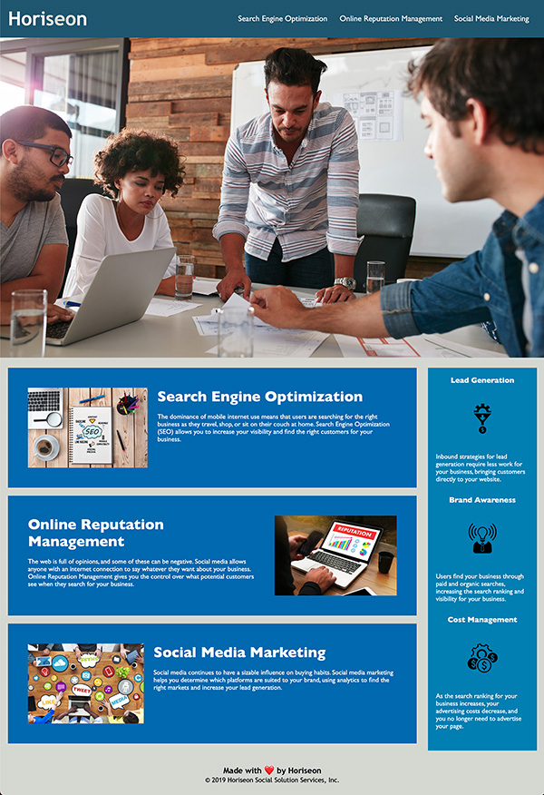

# Refactor code for horiseon webpage to meet accessibility standards

## Outline of actions taken

Proofed index.html code and made the following revisions:

- Changed text in title tag to 'Horiseon Social Solution Services'
- Added comment tags to more easily identify the different aspects of the page
- Added 'id="search-engine-optimization"'to div so that the 'Search Engine Optimization' link would work
- Fixed an improperly written img tag by removing the closing tag and add ' /' inside the original tag
- Changed h3 tags to h2 tags as accessibilty standards state that h3 tags should only be used when the heading is a subheading of the 
- Changed div tags to header, section and footer tags where appropriate

Proofed style.css page and made the following revisions:
- Updated css to include refernce to header section and footer tags. 
- Changed referenes to h3 tags to h2
- Reordered CSS to match the flow of the document
- Consolidated duplicated CSS references
- Added comments

## Screenshot of finished page

## Link to finished webpage
[Horiseon site](https://e-p-n.github.io/horiseon/)